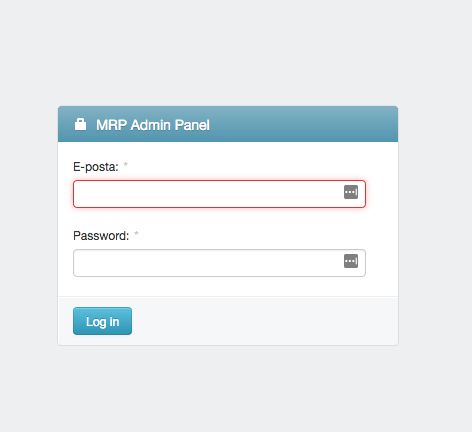
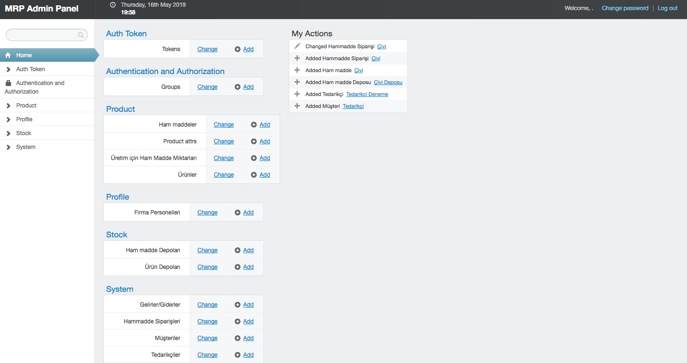
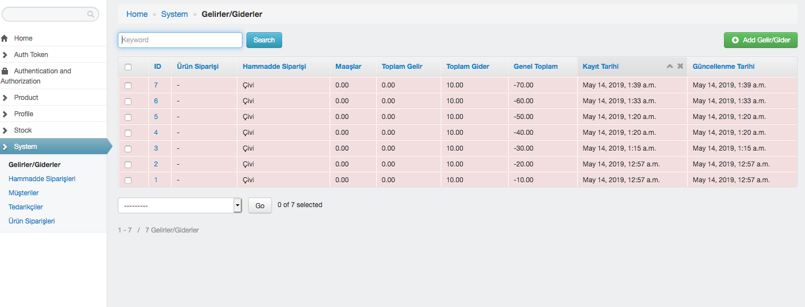
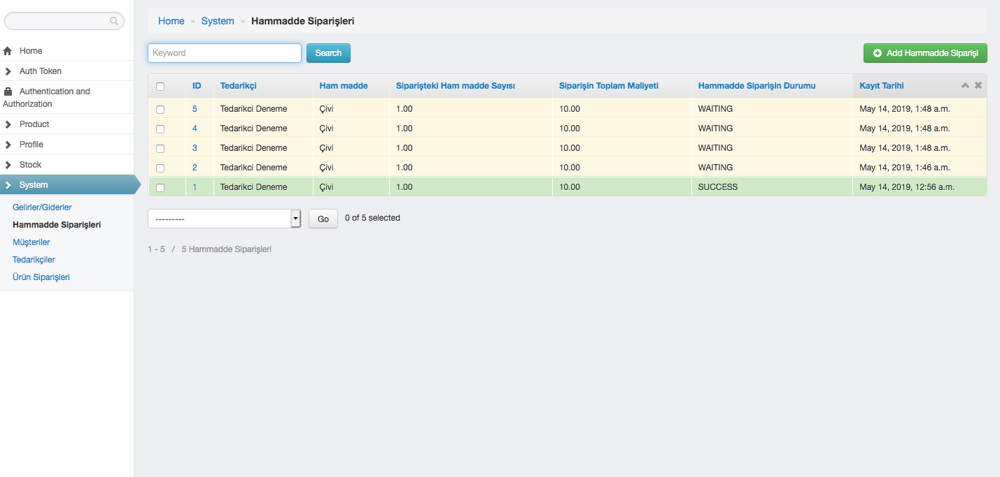
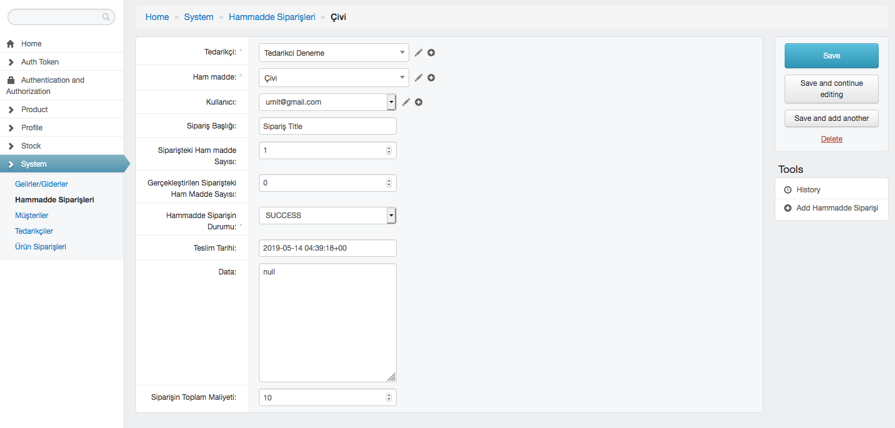
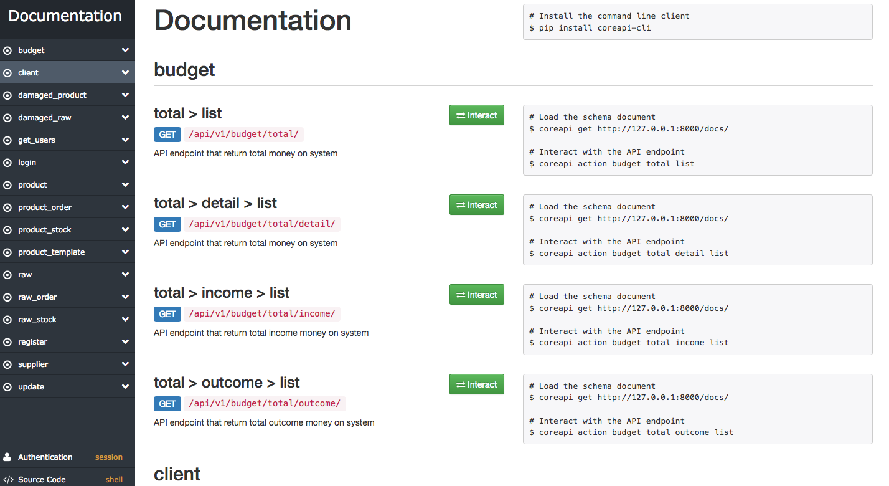
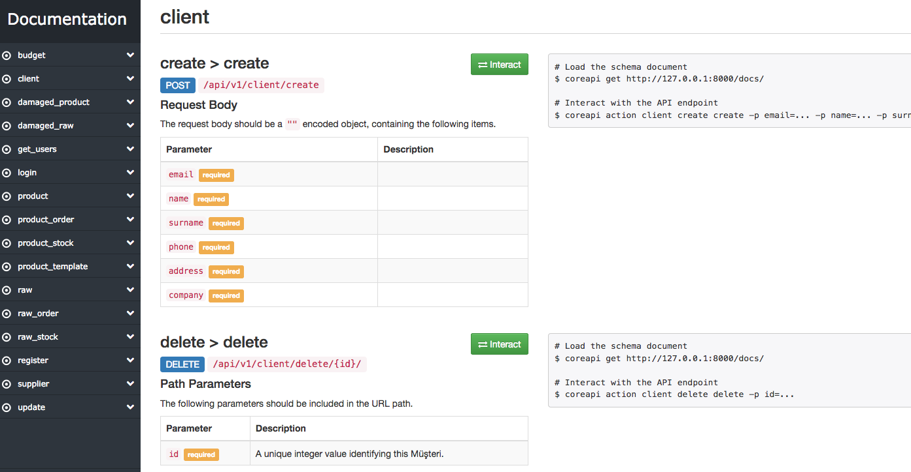

# MRP-Project-System-Analysis--Lesson

We created MRP (Material Requirements Planning) API with Utkucan Bıyıklı. We used Django and DRF. 

<table><tr><td align="center"><a href="https://github.com/umit-ozturk">  <b>Ümit Öztürk</b></a> </td><td align="center"><a href="https://github.com/UtkucanBykl">  <b>Utkucan Bıyıklı</b></a> </td></tr></table>  

## Installation
Clone the repository and create a virtual environment.

    $ git clone https://github.com/umit-ozturk/MRP-Project-System-Analysis--Lesson.git
	$ cd MRP-Project-System-Analysis--Lesson
	$ virtualenv -p python3 env
	$ source env/bin/activate
    $ pip install -r requirements.txt
    $ cd netplas

## Create user

    $ python manage.py createsuperuser
    
## Run Server
    
    $ python manage.py runserver

## Screenshots

